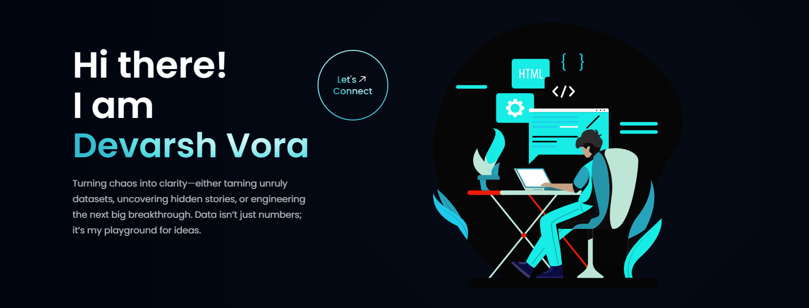

# Personal Portfolio



### Deployed Link: [https://parthmittal.netlify.app/](https://parthmittal.netlify.app/)

## Table of Contents 📁

1. [Tech Stack](#tech-stack)
2. [Implemented Sections](#implemented-sections)
3. [Using as a Theme](#using-as-a-theme)
4. [Contributing](#contributing)
5. [Installation Guide](#installation-guide)
6. [Sample Git Workflow](#sample-git-workflow)
7. [References & Inspirations](#references--inspirations)
8. [Illustrations](#illustrations)

## Tech Stack 🧰

**Frameworks**

- [ReactJS](https://reactjs.org/)
- [Tailwind CSS](https://tailwindcss.com/)

**Libraries/Tools**

- [ViteJS](https://vitejs.dev/)
- [React Icons](https://react-icons.github.io/react-icons)
- [Framer Motion](https://www.framer.com/motion/)
- [React Lottie](https://www.npmjs.com/package/react-lottie)
- [Meraki UI](https://merakiui.com/components/)

## Implemented Sections ☑️

- Hero Section  
- Skills & Experience  
- Education  
- Projects  
- Blogs  
- Open Source Contributions  
- Extra Curricular  
- Contact Me

## Using as a Theme ✨

### Code Changes

To customize this portfolio:

1. **Personal Information**  
   Modify `src/constants/index.js`.  

   For icons:  
   Visit [React Icons](https://react-icons.github.io/react-icons/search), find the icon (e.g., `SiReact`), and import like this:

   ```js
   import { SiReact } from "react-icons/si";
   ```

2. **Website Title and Icon**  
   Update `<title>` and `<link rel="icon">` in `index.html`.

3. **Assets**  
   Add your images to `src/assets`, and update `src/assets/index.js` accordingly.

4. **Creating a .env File**  
   Create `.env` in the root directory:

   ```env
   VITE_GH_TOKEN=your_github_token
   ```

## Deployment

Deploy the site using [Netlify](https://docs.netlify.com/).  
Add your `.env` variables in the Netlify UI:  
👉 [Netlify Environment Variables Guide](https://docs.netlify.com/environment-variables/get-started/#site-environment-variables)

## Contributing 🏆

We welcome contributions in the form of pull requests, issues, and documentation! ❤️

- Please follow our [Code of Conduct](https://github.com/devarshvora/devarsh-vora-portfolio/blob/main/CODE_OF_CONDUCT.md).
- See the [Installation Guide](#installation-guide) and [Git Workflow](#sample-git-workflow) below.

## Installation Guide 🧑‍💻

### Clone the Repository

```bash
git clone https://github.com/your-username/devarsh-vora-portfolio.git
cd devarsh-vora-portfolio
```

### Set Up Remote

```bash
git remote add upstream https://github.com/devarshvora/devarsh-vora-portfolio.git
```

### Install Dependencies

```bash
npm install
```

### Start the Dev Server

```bash
npm run dev
```

## Sample Git Workflow

```bash
# Create a new branch
git checkout -b feature/your-feature

# Make and commit your changes
git add .
git commit -m "Add new feature"

# Update local main branch
git checkout main
git pull upstream main

# Rebase your feature branch
git checkout feature/your-feature
git rebase main

# Push your feature branch
git push origin feature/your-feature
```

Then [open a pull request](https://github.com/devarshvora/devarsh-vora-portfolio/pulls).

## References & Inspirations 👏

- [JavaScript Mastery](https://youtu.be/_oO4Qi5aVZs)
- [DeveloperFolio](https://developerfolio.js.org/)
- [MasterPortfolio](https://github.com/ashutosh1919/masterPortfolio)

## Illustrations 🖼️

- [Coding Lottie](https://lottiefiles.com/90189-coding) by Yamesh Sai Balaji  
- [Quiz Mode Lottie](https://lottiefiles.com/92377-quiz-mode) by SenecaDan

